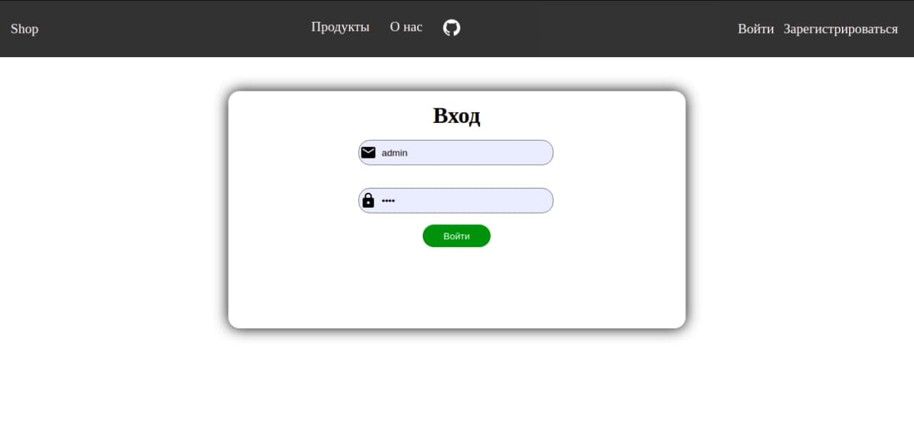
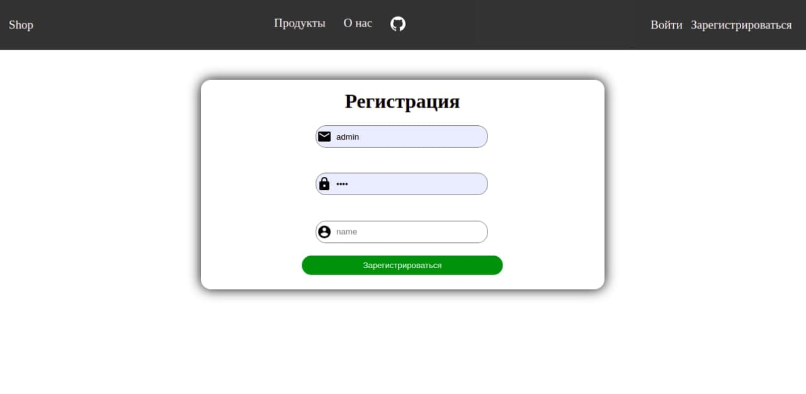

<h1 style='text-align:center'>Online Shop</h1>

    <h4>Установка: </h3>
    <ul>
        <li>Зайти в папку <b>server</b>, ввести команду <i>npm install,затем node index.js</i></li>
        <li>Зайти в папку <b>client</b>, ввести команду <i>npm install,затем npm start</i></li>
    </ul>

Вход в аккаунт

Регистрация

Статистика пользователя

Настройки аккаунта

Управления аккаунтом

Профиль

Создание товара

Список всех товаров для покупки

